```mermaid
flowchart TB
    subgraph Client["Client Layer"]
        User["👤 User Request"]
    end

    subgraph LangGraph["LangGraph Service"]
        Agent["🤖 LangGraph Agent"]
        Runtime["Runtime"]
        
        subgraph Middleware["Agent Middleware"]
            SM["SandboxMiddleware"]
            SM -->|"abefore_agent()"| Connect["Connect/Create Sandbox"]
            SM -->|"aafter_agent()"| Cleanup["Cleanup/Persist"]
        end
        
        subgraph Tools["Tool Layer"]
            BashTool["🔧 bash()"]
            DownloadTool["📥 download_artifact()"]
            OtherTools["🔍 Other Tools\n(Tavily, etc.)"]
        end
    end

    subgraph SandboxAbstraction["Abstract Sandbox Layer"]
        direction TB
        
        ISandbox["«interface»\nSandboxManager"]
        ISandbox -->|"create()"| Create["Create Sandbox"]
        ISandbox -->|"connect(id)"| ConnectOp["Connect to Sandbox"]
        ISandbox -->|"execute(cmd)"| Exec["Execute Command"]
        ISandbox -->|"read_file(path)"| Read["Read Files"]
        ISandbox -->|"write_file(path)"| Write["Write Files"]
        ISandbox -->|"destroy()"| Destroy["Destroy Sandbox"]
    end

    subgraph Implementations["Sandbox Implementations"]
        direction LR
        
        E2BImpl["E2B Sandbox\n(AsyncSandbox)"]
    end

    subgraph E2BDetails["E2B Infrastructure"]
        E2BCloud["☁️ E2B Cloud"]
        Template["📦 Custom Template\n(runner)"]
        VMInstance["🖥️ VM Instance"]
        FileSystem["📁 Sandbox FileSystem"]
        BashRuntime["⚡ Bash Runtime"]
        NodeRuntime["⚡ Node.js Runtime"]
    end

    %% Connections
    User --> Agent
    Agent --> Runtime
    Runtime --> Middleware
    Middleware --> Tools
    
    BashTool -->|"commands.run()"| ISandbox
    DownloadTool -->|"files.read()"| ISandbox
    
    ISandbox --> E2BImpl

    
    E2BImpl --> E2BCloud
    E2BCloud --> Template
    Template --> VMInstance
    VMInstance --> FileSystem
    VMInstance --> BashRuntime
    VMInstance --> NodeRuntime

    %% Styling
    classDef interface fill:#e1f5fe,stroke:#01579b,stroke-width:2px
    classDef impl fill:#e8f5e9,stroke:#2e7d32,stroke-width:2px
    classDef future fill:#fff3e0,stroke:#ef6c00,stroke-width:2px,stroke-dasharray: 5 5
    classDef cloud fill:#fce4ec,stroke:#c2185b,stroke-width:2px
    classDef agent fill:#ede7f6,stroke:#512da8,stroke-width:2px
    
    class ISandbox interface
    class E2BImpl impl
    class E2BCloud,Template,VMInstance,FileSystem,BashRuntime,NodeRuntime cloud
    class Agent,State,Runtime,SM agent
```

## Architecture Overview

### Layers

1. **Client Layer** - User requests come into the LangGraph service
2. **LangGraph Service** - Core agent orchestration with middleware pattern
3. **Abstract Sandbox Layer** - Interface defining sandbox operations
4. **Implementations** - Concrete sandbox providers (E2B, Docker, Modal, etc.)

### Key Components

| Component | Responsibility |
|-----------|---------------|
| `SandboxMiddleware` | Lifecycle management - connects before agent runs, cleans up after |
| `SandboxManager` | Abstract interface for all sandbox operations |
| `E2B Sandbox` | Cloud-based isolated execution environment |
| `Tools` | Expose sandbox capabilities to the LLM agent |

### Data Flow

```
User Request → Agent → Middleware → Tools → SandboxManager → E2B Cloud → VM Execution
```

---

## Sandbox Lifecycle

```mermaid
flowchart LR
    subgraph Templates["Template Inheritance"]
        Base["🐧 Base Image"]
        Node["🟢 Node.js"]
        Python["🐍 Python"]
        Custom["📦 Custom\n+ deps + config"]
        
        Base --> Node & Python
        Node & Python --> Custom
    end
    
    subgraph Lifecycle["Sandbox Lifecycle"]
        Create["Create"] --> Ready["Ready"]
        Ready --> Execute["Execute"]
        Execute --> Ready
        Ready --> Destroy["Destroy"]
    end
    
    Custom -->|"Sandbox.create(template)"| Create
```



### Template Example

```python
template = Template() \
    .from_node_image() \
    .npm_install(["@playwright/test"]) \
    .build(alias="runner", cpu_count=2, memory_mb=2048)
```